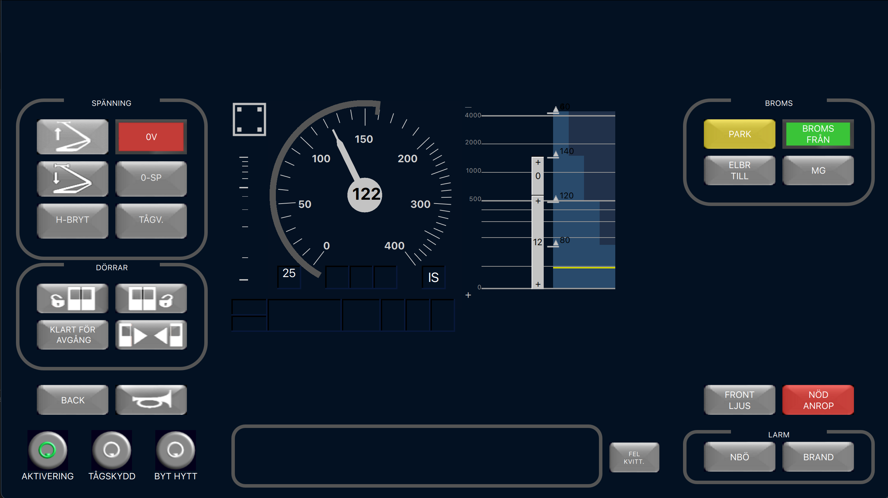

# Driver Machine Interface

A project in which a standalone Driver Machine Interface (DMI) is developed. The DMI is designed to be used togheter with a simulator made by VTI, The Swedish National Road and Transport Research Institute.

## Information about QT

The DMI is implemented in QT, version 6.4. 

### How to start the application

To start the application, do the following steps:

- Build / run the *test_module* application.
- Wait until the test_module has started (indicated by the debug message **server started**). 
- Build / run the *train_dmi* application. 

## Known bugs
- The speedometer doesn't scale with the window and remains 

## Improvements
- The Circular Speed Gauge is drawn with the QML object called "Path Angle Arc". This object draws a circle arc from a start angle and to a end angle. However this object also has a stoke width value that is used to specify the width of the arc. This causes the circle arc to be drawn to far. We believe that the amount the arc is drawn to far with is the angle that corresponds to half the stroke width.
- The gradient profile consists of four "rectangles", a improvement would be that this amount is dynamically determined during runtime. 
- There is currently a delay (around 10ms) when sending data. This is needed so not to interrupt the functions that handle the received data. This is probably not a optimal solution.

## Licence

Resultatet som genererats av studenten inom ramen för projektet ska ägas av *VTI*, statens väg- och transportforskningsinstitut som kan ta det i drift och vidareutveckla det. Studenten bibehåller rätten att stå som upphovsman och visa upp de ursprungliga resultaten, t ex i CV och portfolio.

### Authors

Filip Kjellgren

Viktor Lindell

Linus Olsson

Pontus Kågström

Erik Delbom

Linus Bergman

Mikael Johnsson